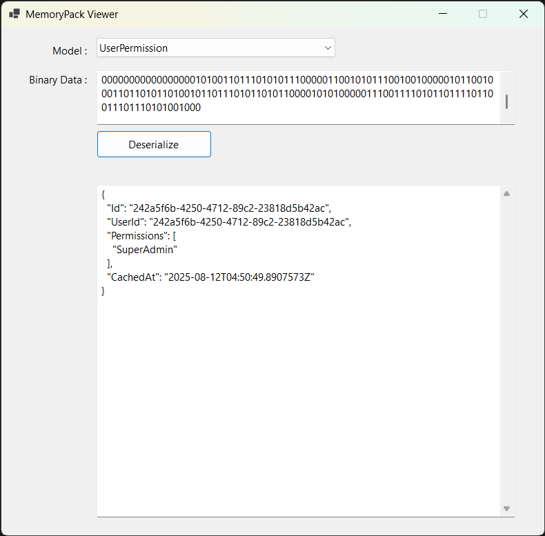

# 📦 MemoryPack Viewer

**MemoryPack Viewer** is a lightweight Windows Forms tool for **deserializing binary data** into strongly typed objects using [MemoryPack](https://github.com/Cysharp/MemoryPack).  
It’s perfect for quickly inspecting serialized objects during debugging or reverse engineering.

---

## ✨ Features
- 🔹 **Multiple model support** – Select the desired type from a dropdown.
- 🔹 **Binary & Hex input** – Paste your serialized data directly.
- 🔹 **MemoryPack deserialization** – Uses `MemoryPackSerializer.Deserialize<T>` for fast object reconstruction.
- 🔹 **Formatted JSON output** – Automatically pretty-prints for readability.
- 🔹 **Simple UI** – Minimal, fast, and developer-friendly.

---

## 📸 Screenshots

| Input View | Output View |
|------------|-------------|
|  |  |

> Place your screenshots in an `assets` folder inside the repo.

---

## 🚀 Usage

1. **Select** the model type from the dropdown.
2. **Paste** your serialized data (binary or hex) into the input textbox.
3. Click **Deserialize**.
4. View your object as clean, indented JSON.

---

## 🛠 Tech Stack
- **C#** (.NET 8 / WinForms)
- **[MemoryPack](https://github.com/Cysharp/MemoryPack)** for serialization/deserialization
- **System.Text.Json** for JSON formatting

---

## 📦 Installation
Clone the repository and build the solution:

```bash
git clone https://github.com/YourUsername/MemoryPackViewer.git
cd MemoryPackViewer
dotnet build
